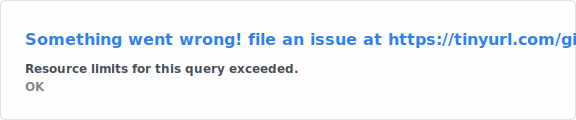

<div align="center">

## Hi there 👋 I'm Gabriel

</div>

---

### 🧑‍💻 About Me

```python
class Gabriel:
    role      = "Security Engineer"
    interests = ["Cloud Security", "DevOps", "Automation", "Open Source", "Skydiving", "Music"]

    def say_hi(self):
        return "Thanks for stopping by! Let's build something awesome 🚀"
```

---

### 📊 GitHub Stats

<table>
  <tr>
    <td align="center">
      
    </td>
    <td align="center">
      
    </td>
  </tr>
</table>

---

<div align="center">
  <sub>⚡ Automating the boring stuff since forever &nbsp;·&nbsp; Rank A and climbing 📈</sub>
</div>
